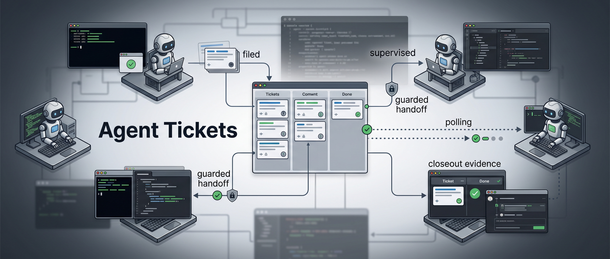

# Agent Tickets

Recommended setup path: let your Claude Code or Codex coding agent drive this
from the start. The installer touches local agent hooks, user-level CLI paths,
Kanboard API configuration, and the companion Agent-Terminal-Contact dependency;
an agent can check those pieces, run the right installer for your OS, and
escalate when a prerequisite needs your approval.

`Agent Tickets` is an agent ticket filing system for Claude Code and Codex:
agents file structured tickets, route them to the repo that owns the work, and
track the fix through closeout. It is built for environments where many
repositories work together tightly, each repo may have its own owner agent, and
work often crosses repo boundaries.

Think of it as the local, agent-operated counterpart to team issue trackers
such as Jira, Linear, GitHub Issues, or Kanboard itself. Those systems coordinate
human teams, product backlogs, sprint work, and external project reporting;
Agent Tickets coordinates AI coding agents working across a local multi-repo
environment, with machine-friendly routing, guarded owner-agent contact, and
closeout evidence built into the workflow.

The workflow is designed to be mostly autonomous once the system is installed.
The user should not need to babysit every handoff: the active agent files the
ticket, explains when routing or supervised resolution makes sense, asks for
confirmation before contacting or launching an owner agent, and can then poll
the ticket while the owner agent works. The user stays in the approval loop for
cross-agent routing decisions, but does not have to manually relay status
between repos.

Use it when one repo's agent needs another repo's agent to fix a bug, implement
a supporting feature, repair setup/docs, investigate an integration break, or
unblock a dependent workflow. The ticket becomes the durable handoff: what is
needed, which repo owns it, who is working it, what evidence proves it was fixed,
and whether the requester needs a callback when it closes.

The point is to stop cross-repo work from getting lost in chat history or
handled through unsafe ad hoc agent messages. `agent-tickets` gives agents a
shared local board plus guarded routing, supervision, and closeout checks so
work can move from the requesting repo to the owning repo and back with an audit
trail.

The system is built around a self-hosted Kanboard instance plus a small
dependency-free Python CLI:

- `agent-ticket new` files a structured ticket with kind, severity, project,
  agent, tags, and body text.
- `agent-ticket list/show/comment/move/tag/close/reopen` handles normal board
  operations from the terminal.
- `agent-ticket dispatch` can explicitly notify the owner agent for another
  repo.
- `agent-ticket supervise` and `supervise-batch` can route higher-stakes work
  through guarded tmux-managed owner-agent sessions, poll progress, and run
  closeout checks.
- Installed agent hooks can surface open tickets automatically when Codex or
  Claude starts in a repo.

This is intentionally not a generic TODO list. It is for cross-repo dependencies,
inter-agent requests, integration blockers, bug fixes, support features, and
other work that needs a durable owner/reporter handoff.

The board is local-first:

- Kanboard runs on `http://localhost:8765`.
- Ticket data lives in `~/kanboard-data`.
- The API token lives in `~/.config/agent-tickets/config.json`.
- Nothing is stored in a cloud ticket service.
- Normal ticket operations use the installed CLI at `~/.local/bin/agent-ticket`.

This repository is the source copy. `install.sh` copies the CLI, skill docs,
hooks, and compose file into their runtime locations; it does not symlink them.
Re-run `install.sh` after source changes to roll out updates.

## Dependencies

Hard runtime dependencies:

- Python 3
- Docker with the Docker Compose plugin
- `kanboard/kanboard:v1.2.52`, started locally by `docker-compose.yml`
- A Kanboard application API token in `~/.config/agent-tickets/config.json`

Coordination dependency:

- [`Agent-Terminal-Contact`](https://github.com/tarkansarim/Agent-Terminal-Contact),
  which should be installed alongside `agent-tickets` for cross-repo agent
  coordination. It provides:
  - `agent-contact`: guarded cross-agent messaging for dispatch, callbacks, and
    safety checks.
  - `agent-tmux`: deterministic Codex/Claude worker launch and session discovery
    wrapper used by `supervise` and `supervise-batch`.
- Repo roots configured in `repo_roots`, defaulting to `~/Dropbox/work/MyTools`,
  so `project:<repo-name>` tickets can resolve to source repo paths.

Without `Agent-Terminal-Contact`, normal ticket filing, listing, comments,
moves, closes, and Kanboard board operations still work. Cross-repo owner-agent
handoff, callbacks, and supervision need `agent-contact`/`agent-tmux` on `PATH`
and trusted-root environment variables configured.

Agent onboarding check:

```bash
command -v agent-contact
command -v agent-tmux
agent-contact artifact-info --all --json
```

If those tools are missing, clone and install the dependency:

```bash
cd ~/Dropbox/work/MyTools
git clone https://github.com/tarkansarim/Agent-Terminal-Contact.git
cd Agent-Terminal-Contact
bash scripts/install.sh --force
bash scripts/install.sh --check
```

## Layout

```
agent-tickets/                          # <- dev / source of truth (this folder, in Dropbox)
  bin/agent-ticket        # the CLI agents use            -> installed as a real copy to ~/.local/bin/agent-ticket
  skill/SKILL.md          # agent skill                   -> installed as real copies to existing ~/.claude and ~/.codex skills
  docker-compose.yml      # Kanboard container def (pinned version) -> copied to ~/.config/agent-tickets/docker-compose.yml
  config.example.json     # token-less template           -> seeds ~/.config/agent-tickets/config.json (only if missing)
  bootstrap-board.py      # idempotently creates the project + columns + categories in Kanboard, writes project_id to config
  install.sh              # roll out onto a machine (idempotent; copies, doesn't symlink; installs CLI plus Claude Code/Codex skills and hooks when those provider homes exist, runs bootstrap once a token is set)
  install-windows.bat     # native Windows installer entrypoint
  scripts/install-windows.ps1    # PowerShell implementation for native Windows install
  scripts/notify-hook.sh        # agent-neutral hook: surfaces open tickets for the repo the agent is in -> ~/.config/agent-tickets/notify-hook.sh
  scripts/register-hooks.py     # idempotently wires notify-hook.sh into ~/.claude/settings.json and ~/.codex/hooks.json
  scripts/check-kanboard-version.sh   # compares the pinned Kanboard image tag against the latest release
  scripts/smoke-fresh-install.sh      # isolated fresh-HOME installer smoke test for Linux/WSL onboarding
  README.md               # this file
  DECISIONS.md            # design history / rationale
  .gitignore              # if ever git-tracked: never commit data/ or the real config
```

After install, the *live* system is entirely under `~/.local/bin`, existing provider skill/config directories such as `~/.claude/skills` and `~/.codex/skills`, `~/.config/agent-tickets`, and `~/kanboard-data` — independent of this folder for normal ticket operations. `~/.config/agent-tickets/source.json` is non-secret provenance metadata for `agent-ticket source-info`; if this source folder is missing, the CLI still works but source diagnostics report it as missing.

## Lives OUTSIDE this folder (on purpose — this folder is in Dropbox)

- **Live Kanboard DB & data:** `~/kanboard-data/` (override with `KANBOARD_DATA_DIR`; `install.sh` refuses paths under the repo, your home dir itself, or known cloud-sync roots). A SQLite file being actively written + Dropbox sync = corruption risk, so it must be a local, non-cloud-synced path. The files inside are written by the Kanboard container under its own uid, so their permissions are container-managed (not locked down by `install.sh`) — keep `~/kanboard-data` itself on a single-user machine / private home.
- **Real API token / config:** `~/.config/agent-tickets/config.json` (chmod 600, inside a chmod-700 `~/.config/agent-tickets/`). Don't put the token in cloud-synced storage. The same directory also holds the installed `docker-compose.yml` and a generated `.env` recording `KANBOARD_DATA_DIR`, so `docker compose -f ~/.config/agent-tickets/docker-compose.yml up -d` works without re-passing the env var.
- **Source provenance manifest:** `~/.config/agent-tickets/source.json` (non-secret). Written by `install.sh`; records the source folder, copy mode, CLI hash, and source git status visible at install time for `agent-ticket source-info`.

For portability/backup, periodically copy `~/kanboard-data/data/db.sqlite` somewhere safe (you could keep copies in `agent-tickets/backups/`, which `.gitignore` excludes from git but Dropbox will still sync — fine for a *static* copy, not the live file).

## Quick Start

Install targets:

- Linux
- Native Windows

Prerequisites:

- Python 3
- Docker with the Docker Compose plugin, or Docker Desktop on Windows
- Linux: `~/.local/bin` on your shell `PATH`
- Windows: `%USERPROFILE%\.local\bin` on your `PATH`

There is no virtualenv and no `pip install` step.

Install on Linux:

```bash
git clone <repo-url> agent-tickets
cd agent-tickets
./install.sh
```

Install on Windows:

```bat
git clone <repo-url> agent-tickets
cd agent-tickets
install-windows.bat
```

Finish first-time setup:

1. Open `http://localhost:8765`.
2. Log in with `admin` / `admin`.
3. Change the password.
4. Go to **Settings → API**.
5. Copy the API token into `~/.config/agent-tickets/config.json`.
6. Run `./install.sh` again.
7. Run `agent-ticket columns`.

Successful setup should show:

```text
1. New
2. Triaging
3. Agent working
4. Needs human
5. Done
```

Use it:

```bash
agent-ticket new --title "..." --kind bug --severity p2 --project <repo-name> --agent codex --body "What happened"
agent-ticket list
agent-ticket show <id>
agent-ticket comment <id> "Evidence or update"
agent-ticket close <id>
```

Re-run `./install.sh` after source updates. It overwrites installed code/docs, but it does not overwrite your real `~/.config/agent-tickets/config.json`.

On Windows, re-run `install-windows.bat` after source updates.

Installer smoke test for maintainers:

```bash
scripts/smoke-fresh-install.sh linux-no-docker
```

To verify installed artifacts before editing or rolling out:

```bash
agent-ticket source-info
```

This command does not contact Kanboard and does not need the API token. It reports the installed path, source path, copy-vs-symlink mode, whether the installed CLI, Codex/Claude skill copies, and notify hook match source, and the source git status. If git is unavailable or the source folder has invalid metadata, it reports that explicitly; maintenance still happens by editing this source folder and re-running `./install.sh`.

## Agents noticing tickets (cross-agent)

The skill works for **both Claude Code and Codex**. When their user-level config directories already exist, `install.sh` copies `skill/SKILL.md` into `~/.claude/skills/agent-tickets/` and `~/.codex/skills/agent-tickets/` (same format), and the `agent-ticket` CLI is the same binary for any agent. If a provider is not installed yet and its user-level directory is absent, the installer prints an explicit skip for that provider; re-run the installer after installing that provider.

So agents don't have to *remember* to look, `install.sh` also registers a **notify hook** (`scripts/notify-hook.sh`, installed to `~/.config/agent-tickets/`) that surfaces open tickets for the repo the agent is working in:

- **Claude Code** — `SessionStart` (lists what's open now) + `UserPromptSubmit` (shows any ticket that appeared since, once).
- **Codex** — `SessionStart` prints the baseline list. `Stop` runs a Codex-specific silent cache refresh (`codex-stop-changes`) so Stop stdout stays empty and satisfies Codex's hook JSON contract. *Codex validates hooks by hash, so the first `codex` run after install will ask you to trust the new hook — approve it.*

The hook derives the repo name from the git toplevel (matching the `project:<name>` tag convention), prints `🎫 Open/New agent-ticket(s) for <repo>: …`, and also surfaces pending watched-ticket callbacks from the local outbox. It is **silent** when there's nothing new, Kanboard is down, or the CLI isn't installed (it never blocks the agent). "Already surfaced" state is per-repo in `~/.cache/agent-tickets/`, so persistently-open tickets don't re-nag.

## Usage

See `skill/SKILL.md` for the full agent-facing guide. Quick reference:

```bash
agent-ticket new --title "..." --kind bug --severity p2 --project <app> --agent <name> --body '...'
agent-ticket list [--all] [--column "Needs human"] [--kind blocker] [--project <app>] [--agent <name>]
agent-ticket show <id>
agent-ticket comment <id> "..."
agent-ticket move <id> "Agent working"      # New / Triaging / "Agent working" / "Needs human" / Done
agent-ticket tag <id> --add source:test-run
agent-ticket close <id> / reopen <id>           # close moves the ticket to Done first
agent-ticket closeout-check <id> --strict        # supervisor closeout evidence gate
agent-ticket columns
agent-ticket source-info                        # installed/source provenance + source git status
agent-ticket new --project <app> ... --dispatch    # file, then ping <app>'s owner agent (best-effort)
agent-ticket dispatch <id>                          # ping the owner agent for an already-filed ticket
agent-ticket dispatch <id> --dry-run                # resolve/probe without comments, moves, or contact
agent-ticket supervise <id> --full-permission       # route owner agent, poll ticket, check closeout
agent-ticket supervise-batch --dry-run              # group open tickets by repo and show route plans
agent-ticket supervise-batch --full-permission      # one owner worker per repo, same-repo tickets queued
agent-ticket supervision status --repo /path/to/repo # inspect active/stale supervisor claims
agent-ticket supervise <id> --watch-origin --origin-provider codex   # notify this caller when the owner closes it
agent-ticket callbacks --pending --repo <app>       # local pending watched-ticket callback outbox
agent-ticket callbacks retry ticket:42:closed:1     # retry guarded callback delivery
agent-ticket callbacks ack ticket:42:closed:1       # acknowledge after closeout-check
agent-ticket new ... --force                        # create even if a possible-duplicate ticket exists
agent-ticket --json <subcommand>            # machine-readable (--json also works after the subcommand)
```

Ticket URLs the CLI prints are derived from the configured `endpoint` (e.g. `http://localhost:8765/task/42`), so they're correct regardless of Kanboard's own "Application URL" setting.

## Dispatching a ticket to its repo's agent

`agent-ticket new` without `--dispatch` never routes an owner agent, but when the new ticket has a resolvable `project:<name>` tag in a routeable column it prints an `Ask the user now` prompt. Agents should ask that question immediately and run a guarded route only after explicit approval: `agent-ticket dispatch <id>` for best-effort existing-session contact, or `agent-ticket supervise <id> --full-permission` for the monitored route that may launch a deterministic owner worker.

`agent-ticket new` warns about a possible duplicate (same `project:` tag + strongly-matching title; `--force` overrides). `agent-ticket dispatch <id>` (or `new … --dispatch`) is an **explicit, guarded** way to hand a cross-repo ticket to that repo's owner agent: it resolves `project:<name>` → a source repo path (`repo_roots` in config, default `~/Dropbox/work/MyTools`), then uses `agent-contact` to find + safely contact the owning Codex/Claude tmux worker (refusing attached/busy/pending-text/dead/ambiguous sessions). It refuses on `Needs human`, skips p3 by default, won't re-dispatch a ticket already in `Agent working`/`Done`/already-dispatched, records an audit comment on the ticket unless `--dry-run` is used, and moves it `New → Triaging` on a successful send. If there's no contactable session / multiple providers / no resolvable repo / the `AGENT_CONTACT_TRUSTED_*` env vars aren't set, it degrades to a comment and exits 0 (the notify-hook will surface the ticket to the owner at session start anyway). Use `--dry-run` to resolve/probe routing without comments, moves, or real agent contact. See `skill/SKILL.md` for the full loop.

For supervised cross-repo owner work, use `agent-ticket supervise <id>`. It resolves the ticket's `project:<name>` repo, selects an owner lane from a bound contactable tmux session or a fresh deterministic Codex owner lane, sends or launches through `agent-contact`/`agent-tmux`, optionally makes the Codex permission profile visible with `--full-permission`, polls ticket state, and runs `closeout-check` when the ticket closes. By default, single-ticket supervision probes the deterministic ticket-scoped session directly; unrelated same-repo panes are not treated as route identity for that ticket. Existing tmux panes are reused only when guarded `agent-contact` accepts a provider/session identity tied to the exact ticket session, the explicit `--session`, or an active same-owner supervision claim; otherwise contactable panes fail closed as unbound instead of being treated as owner identity. When `agent-contact` dry-run returns success (for example `status=would_send`), `supervise` treats the pane as contactable; any `pane_reason` is informational and pane-state safety stays owned by `agent-contact`. When no safe bound pane exists, Codex fallback uses a new deterministic ticket-scoped session name from `--session-prefix`, the project tag, and the ticket id unless `--session` is supplied. Before requesting a Codex launch, `supervise` asks `agent-tmux codex-existing <repo> <session>` about that exact requested session; if it already exists, the command reuses it only when guarded exact-session `agent-contact` accepts, otherwise dry-run and live mode block with `existing session not contactable` instead of asking `agent-tmux` to launch over the occupied name. After a successful launch, it probes the exact launched session with guarded `agent-contact --dry-run` through the Codex startup window; visible trust or approval prompts block before route audit comments or ticket moves. `supervise` does not use `codex-latest` or `codex-resume-latest`, because latest-chat metadata is not deterministic owner-lane evidence and can point at stale review/subagent context; route output records `resume_latest: skipped` when it launches fresh. Before contacting or launching, `supervise` records a durable local supervision claim keyed by canonical repo path and ticket id; active claims from another supervisor make dry-run and live mode fail closed with owner/origin/worker/heartbeat/expiry details. Refusal/tooling states are reported explicitly and, unless `--no-tool-ticket` is set, recorded as a local `agent-tickets` blocker. Use `--dry-run` to inspect the planned route or an active claim without writing, contacting, or launching. Live `dispatch`, `supervise`, and `supervise-batch` contact/probe paths need `AGENT_CONTACT_TRUSTED_PROVIDER_ROOTS` and `AGENT_CONTACT_TRUSTED_LAUNCHER_ROOTS` in the environment.

For user-level queue draining across the whole local board, use `agent-ticket supervise-batch`. By default it scans open non-`Done` tickets, skips `p3` and `Needs human`, requires one exact `project:<repo>` tag per eligible ticket, resolves repo paths with the same `repo_roots` rules as dispatch/supervise, and groups by the canonical resolved repo path so project-tag aliases for one source tree still get one owner worker. For otherwise in-scope tickets, missing/multiple project tags and unresolved repos are blocking skipped tickets, because they leave open work undrainable. Multiple tickets for the same repo are placed into one ordered prompt queue for that repo worker to process sequentially in one worktree. Different repo groups route in parallel. Batch routing first checks durable supervision claims, then probes guarded `agent-contact` lanes across providers before choosing a route: exactly one safe contactable target tied to an active same-owner provider/session claim identity can be reused, known “no tmux-managed pane found” refusals count as absence, and any busy/attached/pending/ambiguous/unknown provider refusal blocks the repo group. Contactable panes without provider/session claim identity block as unbound stale/unsafe context instead of being reused. If another active claim exists for the same canonical repo or overlapping tickets, dry-run and live mode report `already supervised` and do not present a normal launch/contact plan unless `--force-supervision` is explicit. If no safe bound lane exists and no unsafe provider state exists, it launches one fresh deterministic Codex tmux session named from `--session-prefix` and the repo basename only while holding a local per-repo batch lock through polling/closeout, and only after `agent-tmux codex-existing` returns a recognized no-existing-session result at route selection and again immediately before launch; unknown inspection failures block. After a successful launch, it probes the exact launched session with guarded `agent-contact --dry-run` through the Codex startup window; visible trust or approval prompts block before route audit comments or `New -> Triaging` moves, while ordinary busy/working states remain compatible with a worker processing the launch prompt. Latest-chat metadata is not queried for routing; launch route evidence records `resume_latest: skipped` and never uses an implicit resume target. If an unsafe existing same-repo session is present, the group is blocked instead of launching a duplicate lane. `--dry-run` reports grouping, skipped tickets, active/stale supervision claims, refusals, repo paths, provider/session choices, and launch/contact plans without ticket comments, moves, sends, or launches. After routing, it heartbeats the claim while polling every queued ticket and aggregates per-ticket `closeout-check` results; a ticket still open after the polling limit, moved to `Needs human`, or failed post-route `New -> Triaging` move makes the batch result fail.

Supervision claims live under `~/.config/agent-tickets/supervision/` and are local recovery state, not Kanboard data. Set `AGENT_TICKETS_SUPERVISOR_ID` or pass `--supervisor-id` when a supervisor needs same-owner reentry across processes. Use `agent-ticket supervision status [--repo <path>|--ticket <id>|--claim <id>]` to inspect active and stale claims; `release`, `adopt`, and `steal` require a filter and only act on claims owned by the current supervisor or stale claims unless `--force` is supplied.

`supervise` and `new --dispatch` can opt into a watched-ticket callback with `--watch-origin`; `new --watch-origin` without `--dispatch` is rejected. The watcher records origin metadata locally under `~/.config/agent-tickets/callbacks/`: origin repo, origin provider when supplied, optional tmux session, created/expires timestamps, callback reason, and correlation id. When the watched ticket is closed, `agent-ticket close` preflights watcher/outbox state, reserves a durable local `ticket.closed` outbox record before the Kanboard mutation, then runs `agent-contact send --dry-run` back to the origin and sends only if that guarded probe accepts exactly one safe idle tmux-managed target. If no origin provider was supplied, delivery probes both Codex and Claude and sends only when exactly one provider accepts. If the watcher expired or `agent-contact` refuses or is ambiguous, the record remains pending, an audit comment is left on the ticket, and the notify hook surfaces it later via `agent-ticket callbacks --pending --repo <repo>`. Interrupted `delivering` records become pending again after a short stale timeout, and missing referenced outbox records fail loudly instead of silently dropping a callback. Use `agent-ticket callbacks retry <event_key>` after fixing the unsafe state, and `agent-ticket callbacks ack <event_key>` after the receiver runs `closeout-check` and accepts the evidence. Repeated `close` calls do not duplicate callbacks; `reopen` supersedes any unacknowledged prior close event and resets the watcher so a later close emits the next revision.

`agent-ticket closeout-check <id>` is the independent supervisor gate. It checks closed state, `Done` column, repo resolution, git worktree cleanliness when git is available, validation evidence in ticket comments, commit id/current HEAD, and install/sync evidence when requested. `--strict` requires closed state and validation evidence; `--require-clean`, `--require-commit`, and `--require-install` make those checks blocking for source-heavy tickets.

## Who files vs. who consumes

- **Owner/builder agent for a project:** fixes issues in place — does **not** file tickets — but reads/triages/closes tickets others filed for it (`agent-ticket list --project <app>`). `agent-ticket close <id>` moves the ticket to `Done` before closing, so closed tickets do not remain visually in an in-progress column. `agent-ticket reopen <id>` reopens into `Triaging` by default and records an audit comment; pass `--column New` or another live column when needed.
- **Test / QA / review / exploration subagents** (in "report mode"): **file** tickets for what they find (tag `source:test-run`), don't touch code. The builder drains the queue.

`skill/SKILL.md` has a paste-ready "test/report mode" snippet for briefing test subagents.

## Updating Kanboard

The image is pinned in `docker-compose.yml` (`kanboard/kanboard:vX.Y.Z`) for reproducibility — it won't auto-update, including security fixes. To check and bump:

```bash
scripts/check-kanboard-version.sh        # prints pinned vs. latest release
# if behind: edit the image tag in docker-compose.yml, then either:
./install.sh                             # re-copies compose + `docker compose up -d` (data is bind-mounted, survives)
# ...or, on a machine where it's already installed:
docker compose -f ~/.config/agent-tickets/docker-compose.yml up -d   # picks up KANBOARD_DATA_DIR from the .env there
agent-ticket columns                     # smoke test the API still works against the new version
```

Worth running periodically (or wire it into a routine).

## History / rationale

`DECISIONS.md` — why Kanboard (and why not Beads / Vibe Kanban / GitHub Issues), the architecture, the scope and role decisions, the dogfooding results. `SESSION-2026-05-10.jsonl` is the full build-session chat transcript (git-ignored; API token scrubbed).

## Other agents (Codex, etc.)

The `agent-ticket` CLI works for any agent with shell access — not Claude-specific. Or hit the JSON-RPC API directly at `http://localhost:8765/jsonrpc.php` (HTTP Basic: user `jsonrpc`, password = the token from the config file). A community MCP server (`bivex/kanboard-mcp`) also exists if you want native MCP tools.

Kanboard uses SQLite in this local deployment. If concurrent workers momentarily collide on writes, the CLI retries JSON-RPC responses that explicitly report transient SQLite database locks with short backoff before surfacing an error.
